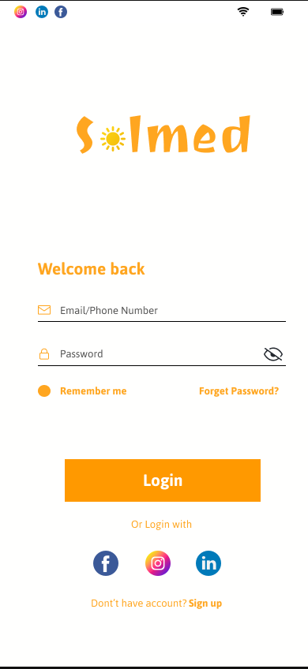
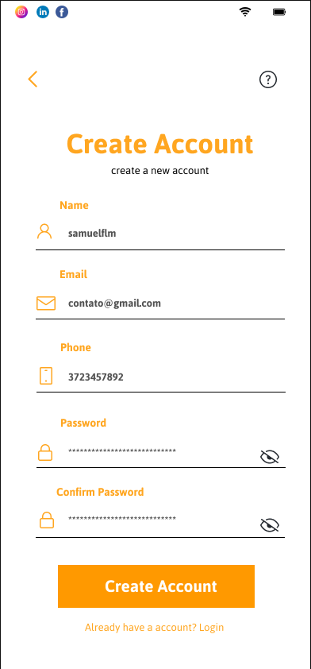

# App Solmed - SAMUELFLM

<!---Esses são exemplos. Veja https://shields.io para outras pessoas ou para personalizar este conjunto de escudos. Você pode querer incluir dependências, status do projeto e informações de licença aqui--->

>Solmed é um aplicativo de gestão de pacientes hospitalares que permite aos usuários marcar consultas, gerenciar seus registros médicos e muito mais. Com uma interface intuitiva e fácil de usar, o Solmed torna mais fácil para os pacientes gerenciarem sua saúde e se comunicarem com seus médicos. Baixe agora e experimente!

### Progresso

> Interface Login.

> Interface Register.

